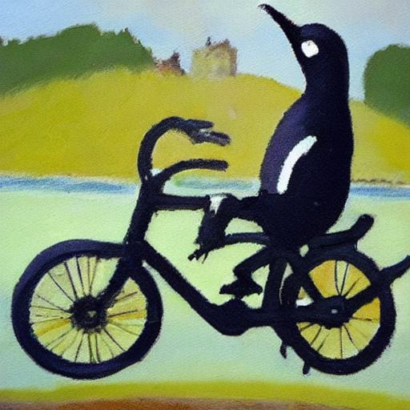

# fing

Generative art + chia + nft oh my

## Introduction

This is the first part of using [stable-diffusion](https://github.com/CompVis/stable-diffusion) to generate art(?) and make [Chia NFTs](https://www.chia.net/2022/06/29/1.4.0-introducing-the-chia-nft1-standard.en.html). Think [DALL-E](https://openai.com/dall-e-2/) but using your own hardware.

This repo handles the image generatration and [a simple REST api](https://github.com/dkackman/fing/blob/main/src/api/open-api.yaml). Eventually it will get integrated into [chia-repl](https://github.com/dkackman/chia-repl) or something else but for now it is just a playground.

What you will need:

- A machine with a decent [CUDA](https://developer.nvidia.com/cuda-downloads) capable graphics card. (NVIDIA RTX 3060 or so - 8GB or more)
- [Anaconda](https://www.anaconda.com/) version 2022.05 (might work on older versions) on that machine
- [Node](https://nodejs.org/en/) on that machine
- I've done this all on ubuntu 22.04. Should work on other linuxes. Might even work on Windows.
- A [Huggingface account](https://huggingface.co/welcome) and [access token](https://huggingface.co/settings/tokens)
  - You will also need to accept [the model license agreement](https://huggingface.co/CompVis/stable-diffusion-v1-4)

### Config File

Create a directory `~/.fing/` and place a copy of [the config file](https://github.com/dkackman/fing/blob/main/src/config.yaml) there.
These settings need to be set specific to your environment:

- `working_dir` - The absolute path to the location of `generate.py` from the repo (will be something like `<your repo root>/src/generator`)
- `output_dir` - Currently python and node communicate via the file system. This is the absolute path where the image will be generated and the node api will pick it up. Can be anywhere that both parts have access to.
- `huggingface_token` - The access token you got above. This is needed to use the model developed by _CompVis_ and licensed under the [OpenRAIL-M](https://github.com/CompVis/stable-diffusion/blob/main/LICENSE) CreativeML license.

### Image Generation

Images are generated by a python program running in the conda environment. Make sure to run the python script at least once before trying the Node API.
This will download the model checkpoints which are quite large, but only need to download once.

```bash
cd src/generator
conda env create -f environment.yaml
conda activate fing

python generate.py "An impressionist painting of penguin on a bicycle."
```



### REST service

This is a node express webservice. It invokes the generator program and waits for the resulting file, which is then retruned to the call.

```bash
cd src/api
npm install
npm start
```

This will run the service on port 3010 by default:

<<http://localhost:3010/api/text2img?prompt=Proof> of space and time>.


